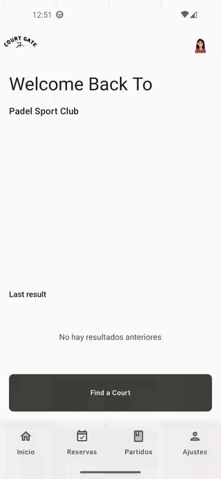
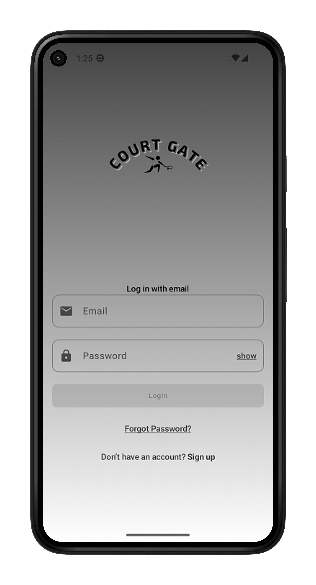
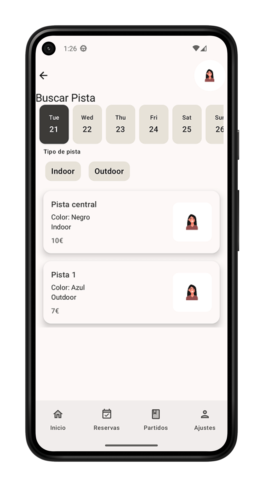
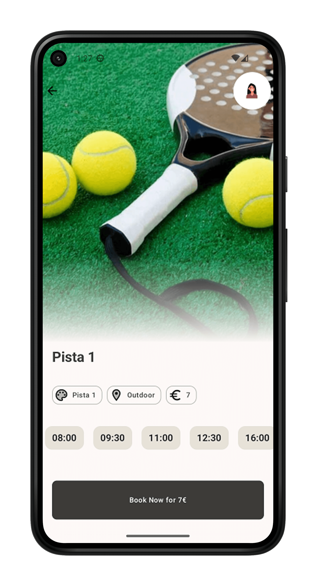

<div align="center">

# 🎾 CourtGate

**Android app for smart booking management in padel clubs.**

From paper sheets and WhatsApp groups to a booking in 3 taps.


</div>

---

## 📱 Demo

<p align="center">
  A quick walkthrough of CourtGate's main flow:
  authentication → court search → booking.
</p>

<p align="center">
  
</p>

<p align="center">
  <sub><i>Full flow in ~10s — Login → Home → Find Court → Booking.</i></sub>
</p>

<br/>

### Main screens

<table align="center">
  <tr>
    <td align="center"><b>Login</b></td>
    <td align="center"><b>Home</b></td>
    <td align="center"><b>Find Court</b></td>
  </tr>
  <tr>
    <td></td>
    <td></td>
    <td></td>
  </tr>
  <tr>
    <td align="center"><b>Booking</b></td>
  </tr>
  <tr>
    <td></td>
  </tr>
</table>

<p align="center">
  <sub>
    The data shown is test data.
  </sub>
</p>

---

## 🎯 About the project

CourtGate is a native Android app designed to **digitize padel court bookings**
in clubs that still rely on paper or manual processes.

The project was born to solve a common problem in local clubs: **the friction and slowness** in
booking management. CourtGate automates this process, eliminating waiting times for players and
freeing the club from administrative burden, all under an interface optimized to be **accessible and
simple**, even for non-tech-savvy users.

Technically, CourtGate is my showcase of **Android best practices:** I implement
**Clean Architecture** and **SOLID** principles with strict layer separation, typed error
handling, automated testing and a modern declarative UI built entirely with
**Jetpack Compose**.

---

## 🚧 Project status

> ⚠️ **Project under active development**. The technical foundation (architecture,
> authentication, offline-first synchronization, court search, testing)
> is implemented. There are pending features documented below.
>
> Access to the Firebase database **is not public** for security reasons.
> The repository is published for the purpose of technical evaluation of the code
> and architecture.

---

## 🧭 For recruiters with little time

If you can only look for 5 minutes, review these files — they show how the project is designed:

| What it demonstrates | File |
|---|---|
| Clean Architecture + MVI + Flow combinators | `ui/presentation/find/FindViewModel.kt` |
| Offline-first with `channelFlow` (remote + local + sync) | `data/ManageCourtRepository.kt` |
| Typed error handling with sealed interfaces | `domain/models/DomainError.kt` + `ResultManage.kt` |
| Type-safe navigation with `kotlinx.serialization` | `ui/navigation/NavigationWrapper.kt` |
| Integration testing ViewModel → UseCase → Repository → fake DataSources | `test/.../find/FindIntegrationTest.kt` |
| Modularized dependency injection | `di/RoomModule.kt`, `di/AuthenticationModule.kt`, `di/firebaseModule.kt` |

---

## 🏛️ Architecture

> The current structure is provisional; the project will evolve toward a
> **layer-based modularization** (separate Gradle modules for `app`, `domain`, `data`,
> `framework`, `usecases`).

Clean Architecture with strict separation into layers:

- **ui** — Jetpack Compose + MVI (State / Event / ViewModel).
- **usecases** — application rules, one use case per action.
- **domain** — pure models and typed errors, no Android dependencies.
- **data** — repositories and DataSource interfaces.
- **framework** — concrete implementations (Room, Firebase, DataStore).

---

## 🧠 Key technical decisions

### 1. Typed error handling
`ResultManage<T, E>` + `sealed interface DomainError` (Auth, Remote, Local, Court).
Instead of propagating generic `Exception`s, the UI receives **exhaustive** errors and
decides which message to display via `DomainErrorUiMapper`.

### 2. Offline-first with `channelFlow`
`ManageCourtRepository.getAllCourtToShow(...)` combines in a single `Flow`:
- A one-time sync (`syncStaticDataIfNeeded`) that only hits Firestore
  if Room is empty **or** the day has changed (tracked in DataStore).
- A continuous stream of bookings for the next 7 days from Firestore, which
  updates Room incrementally (`syncBookings`).
- Emission to UI **always** comes from Room (SSOT), with `distinctUntilChanged`.

The UI keeps working if the remote fails intermittently, and errors are propagated
typed via `DomainException`.

### 3. Lightweight MVI with `combine + flatMapLatest + stateIn`
See `FindViewModel`: user inputs (filter, date) are `MutableStateFlow`s
that are combined, automatically cancel the previous query on change, and the
exposed `StateFlow` is shared with `WhileSubscribed(5000)` to survive
rotations without extra collection.

### 4. Type-safe navigation (Navigation Compose + kotlinx.serialization)
Routes like `data class Booking(val code: String, val date: Long)` are serialized
without magic strings. `composable<Booking>` + `backStackEntry.toRoute<Booking>()`
guarantees that the argument contract is verified at compile time.

### 5. DataStore
Synchronization preferences live in `DataStoreSyncPreferences` exposed
as `Flow<String>`, consistent with the rest of the app.

### 6. Offline strategy
The Home, Match and Settings screens will always be available without internet access, but
the booking screen cannot be interacted with except for the reload button or to navigate
to another screen. It makes no sense to view possibly outdated availabilities or book offline.

---

## 🛠️ Stack

| Area | Technology |
|---|---|
| Language | Kotlin (Coroutines, Flow, sealed interfaces) |
| UI | Jetpack Compose + Material 3 |
| Architecture | Clean Architecture + lightweight MVI |
| DI | Dagger-Hilt (+ `hilt-navigation-compose`, `hilt-work`) |
| Local persistence | Room + DataStore Preferences |
| Backend | Firebase Authentication + Cloud Firestore |
| Navigation | Type-safe Navigation Compose (`kotlinx.serialization`) |
| Testing | JUnit4, Mockito-Kotlin, Turbine, `kotlinx-coroutines-test` |

---

## 🧪 Testing

Current coverage in `app/src/test/`:

- **Repositories**: `AuthenticationRepositoryTest`, `MatchRepositoryTest`, `ManageCourtRepositoryTest`.
- **ViewModels**: `MainViewModelTest`, `LoginViewModelTest`, `SignUpViewModelTest`, `HomeViewModelTest`, `FindViewModelTest`.
- **UseCases**: `GetAllCourtToShowUseCaseTest`.
- **Integration**: `FindIntegrationTest` — exercises the full flow
  ViewModel → UseCase → Repository → fake DataSources, with `Turbine` to
  validate the state sequence (`Loading → Success/Error`).
- **Support**: `CoroutinesTestRule`, centralized fakes in `fakes.kt` and
  construction helpers (`buildManageCourtRepository`, `createCourtTest`).

---

## 📌 Features

### ✅ Implemented
- Sign up and login (Firebase Auth) with custom validators and MVI.
- Clean layered architecture + modular dependency injection.
- Offline-first synchronization (Firestore ⇄ Room) with frequency control via DataStore.
- **FindCourt** screen with court-type filter and 7-day selector.
- **Booking** screen with free-slot calculation over existing bookings.
- Reusable UI components (`CourtButton`, `CourtTextField`, `CourtNavigationBar`, etc.).
- Type-safe navigation.
- Centralized mapping of domain errors to UI.
- Unit test suite + integration test.

### 🛠️ In progress / next iteration
- **Working on:** Implementing booking logic, pop up and testing of the booking layer.
- Screen to manage match history / results.
- Push notifications (FCM) and reminders with WorkManager.
- Add different authentication methods.
- User and court management for club administrators.
- Instrumented UI tests with Compose Testing.
- CI (GitHub Actions) for build + tests on every push.

---

## 📂 Project structure

```
app/src/main/java/com/example/courtgate/
├── core/              # Cross-cutting extensions and utilities
├── di/                # Hilt modules (Room, Auth, Firebase)
├── domain/models/     # Pure models + DomainError
├── data/              # Repositories + DataSource interfaces
│   └── datasources/
├── framework/         # Implementations: Room, Firebase, DataStore
│   ├── database/
│   └── remote/
├── usecases/          # Use cases per feature
│   ├── authentication/
│   ├── booking/
│   ├── find/
│   └── home/
└── ui/
    ├── navigation/
    ├── presentation/  # Compose screens + ViewModels
    │   ├── login/ signup/ home/ find/ booking/
    │   └── core/      # Reusable components
    └── theme/
```

---

## 🚀 How to run the project

> ⚠️ This project connects to a private Firebase backend. To build
> you will need your own Firebase project and your own `google-services.json`.

```bash
git clone https://github.com/PJEmmanuel/CourtGate.git
cd CourtGate
```

1. Create a project in [Firebase Console](https://console.firebase.google.com/) and enable:
    - **Authentication** → Email/Password
    - **Cloud Firestore**
2. Download `google-services.json` and place it in `app/`.
3. Open the project with **Android Studio (Giraffe or higher)**.
4. Run on an emulator or device with `minSdk 28`.

To run the tests:

```bash
./gradlew testDebugUnitTest
```
